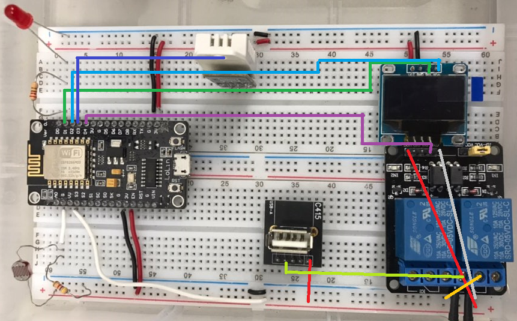

# 설계과제#1 NodeMCU와 Raspberry Pi를 활용한 IoT 서버 설계 및 제작

> 전상규 21500629 
>
> 2020.09.25


## 서론

### 목적

* MQTT 통신을 통해 Rasberry Pi에서 nodeMCU와 통신하며 제어하는 것이 주 목적이다.

### 목표

* NodeMCU에서 Relay를 통한 USBLED, 기본 LED 제어, DHT22를 통해 온도 습도를 읽어오고 cds를 통해 조도 값을 가져온다. 또한, OLED에 온도와 습도를 표시한다.
* Rasberry Pi는 flask를 이용하여 제어를 위한 web server를 구현한다.
* MQTT Server는 제공된 ip와 user를 활용한다.

### 요구사항

* LED
  * led는 Web Broswer에서 toggle,on,off를 통해서 제어 된다.
* USBLED
  * Web Browswer에서 toggle,on,off로 제어 될 수 있다. 이 때, on인 경우 10초 후 자동으로 꺼진다.
  * 높은 조도 값에서 낮은 조도값을 갖을 경우, USB LED가 on 되며, 이 때, Web Browser로 부터의 제어를 제외하고는 10 초 동안 ON 상태를 유지한다. 
* DHT22
  * 10초 마다 OLED에 표시하며 publishing한다.
* CDS
  * 매 loop 마다 조도 값을 받아와 높은 조도 값에서 낮은 조도 값으로 변환되었는 지 판단한다.
  * 10초 마다 publishing 한다.

## 본론

### 회로 구성




### Code: Ardunio

* Header

    * #include <EspMQTTClient.h>: nodeMCU에서 mqtt를 통해 통신하기 위한 library
    * <Wir.h>:  I2C/TWI device와 소통가능하게 하는 library.
    * <Adafruit_GFX.h>: OLED에 graphic을 표한기 위한 graphic core library.
    * <Adafruit_SSD1306.h>: OLED_SSD1306 hardware를 제어하기 위한 library.
    * <Adafruit_Sensor.h>:  Scientifc sensor를 읽고 수정하는 library.
* <DHResp.h>: DHT22를 esp에서 사용하기 위한 library.
  
    ```c
    #include <EspMQTTClient.h>
    #include <Wire.h>
    #include <Adafruit_GFX.h>
    #include <Adafruit_SSD1306.h>
    #include <Adafruit_Sensor.h>
    #include <DHTesp.h>
    ```
    
* #define 부분

    > 주석 참고

    ```c
    //GPIO Pin mapping 부분, nodemcu와 아두이노간 pin이 달라서 초기 설정 필요
    #define SCREEN_WIDTH 128 // OLED display width, in pixels
    #define SCREEN_HEIGHT 64 // OLED display height, in pixels
    
    #define LED_PIN 16 //D0
    #define RELAY1_PIN 2 //D1
    #define DHT_PIN 0 //D3
    #define CDS_PIN A0 //A0
    
    // Sensors and Actuators
    #define LED_ON HIGH 
    #define LED_OFF LOW
    #define RELAY_ON LOW
    #define RELAY_OFF HIGH
    
    //dht type: 22
    #define DHTTYPE DHTesp::DHT22 
    
    
    
    //declare
    Adafruit_SSD1306 display(SCREEN_WIDTH, SCREEN_HEIGHT, &Wire, -1);//Screen
    DHTesp dht; // 온습도 센서 instance 선언 
    ```

* Global Variable

    * previousHTTime: 10초 마다, OLED에 display해야 하며 publishing해야 한다. 이때, 10초를 count해주는 변수
    * preEnvState: ``Previous Envrionment State``의 줄인 말로, 전 loop의 환경의 조도 값에 대하여, 밝으며 1, 어두웠으며 0의 값을 갖는다.
    * led_state: Web Browser에서 toggle을 통해 제어할 때, 기존 led 상태를 저장하는 변수
    * relayOnTime: Relay를 통해  USB LED를 제어한다. 이 때, 10초를 count 해주는 변수
    * currentTime: loop에서 count되고 있는 값들과 비교하기 위한 현재 시간 값을 저장하는 변수
    * controlFlag: 요구사항에서, web broswer를 통한 USB LED 제어는 조도 값에 따른 제어 보다 우선 순위가 높다. 이 때, control Flag를 통해서 USB LED의 on,off를 제어한다. 
        * ``controlFlag == 1 ``: USB LED ON
        * ``controlFlag==2``: USB LED OFF
        * ``controlFlag==0``: Default
    * light_val: 조도 값을 저장하는 변수

    ```c
    //Global Variable
    unsigned long previousHTTime = 0;
    int preEnvState = 1;
    int led_state= 0;
    int relayState = 0;
    unsigned long relayOnTime = 0;
    unsigned long currentTime = 0;
    int controlFlag = 0;
    int light_val = 0;
    ```

* MQTT 설정

    > 주석 참고

    ```c
    
    // Wifi
    const char *wifi_ssid = "J-Kyu"; // 사용하는 공유기 이름
    const char *wifi_password = "password"; // 공유기 password 입력
    
    
    
    // MQTT
    #define mqtt_broker "203.252.106.154" //MQTT broker address(자신의 Raspberry Pi3 IP) 노트북을 통한 모바일 핫스팟에 서 IP check
    #define mqtt_user "iot" //mqtt user name
    #define mqtt_pwd "csee1414" //mqtt user password
    #define TOPIC_GREETINGS "Hello from nodeMCU at 2" //default message for greeting
    String mqtt_payload; //this variable stores string to publish message
    
    
    
    //MQTT Client
    
    EspMQTTClient client(
      wifi_ssid,
      wifi_password,
      mqtt_broker,  // MQTT Broker server ip
      mqtt_user,   // Can be omitted if not needed
      mqtt_pwd,   // Can be omitted if not needed
      "kit_2"      // Client name that uniquely identify your device
    );
    
    
    
    //Subscribe Topic
    const char *sub_topic = "iot/2"; //default subsribe topic
    ```

* callback function

    * 해당 call back 함수는 nodeMCU에서 subscribe하고 있는 topic의 message에 대하여 조건에 맞는 분기를 통해 값을 publishing하거나 sensor 혹은 accuator를 제어하는 함수다.
    * 기본적으로, subscribe을 하고 있을 때, 지정한 topic으로 message가 전달 되었을 때 호출된다.

    ```c++
    void callback(const String& payload) {
     
          unsigned int length = payload.length();
          
          char message_buff[100]; //initialise storage buffer
          String msgString;
          int i = 0;
          Serial.println("Message arrived: topic: " + String("iot/2"));
          Serial.println("Length: "+ String(length,DEC));
    
          for(i=0; i<length; i++){
            message_buff[i] = payload[i];
          }
          
          message_buff[i]= '\0';
          msgString = String(message_buff );
          Serial.println("Payload: "+ msgString);
        
          if (msgString == "led") {
            digitalWrite(LED_PIN, !led_state);
            led_state = !led_state;
            Serial.println("Switching LED");
          }
          else if (msgString == "LED/ON") {
            digitalWrite(LED_PIN, LED_ON);
            Serial.println("LED ON");
          } 
          else if (msgString == "LED/OFF") {
            digitalWrite(LED_PIN, LED_OFF);
            Serial.println("LED OFF");
          } 
          else if (msgString == "dht22") {
            humidity = dht.getHumidity();
            temperature = dht.getTemperature();
            mqtt_payload = String("Temperature is ") + String(temperature) + String(", and Humidity is ") +
            String(humidity);
            client.publish("iot/2/dht22", mqtt_payload.c_str());
            Serial.println("Message sent : " + mqtt_payload);
          } 
          else if (msgString == "dht22_t") {
            temperature = dht.getTemperature();
            mqtt_payload = String("Temperature is ") + String(temperature);
            client.publish("iot/2/dht22_t", mqtt_payload.c_str());
            Serial.println("Message sent : " + mqtt_payload);
          } 
          else if (msgString == "dht22_h") {
            humidity = dht.getHumidity();
            mqtt_payload = String("Humidity is ") + String(humidity);
            client.publish("iot/2/dht22_h", mqtt_payload.c_str());
            Serial.println("Message sent : " + mqtt_payload);
          } 
          else if (msgString == "cds") {
            lightValue = analogRead(CDS_PIN);
            String payload = String("Light intensity is ") + String(lightValue);
            client.publish("iot/2/cds", payload.c_str());
            Serial.println("Message sent : " + payload);
          }
          else if(msgString == "USBLED/ON"){
              digitalWrite(RELAY1_PIN, RELAY_ON);
              controlFlag = 1;
          }
          else if(msgString == "USBLED/OFF"){
              digitalWrite(RELAY1_PIN, RELAY_OFF);
              controlFlag = 2;
          }
          else if(msgString == "USBLED"){
              digitalWrite(RELAY1_PIN, !relayState);
              controlFlag = relayState == 1 ? 1 : 2;
          }
    }
    ```

* onConnectionEstablished()

    * 처음 nodeMCU와 MQTT가 연결이 되었을 경우 호출되는 함수.
    * 이 때, 미리 만들어 두었던 callback 함수를 client가 subscribe하고 있는 부분에 할당하여, subscribe이 되었을 경우 호출되도록 설정해놓는 부분이 첫번째이다.
    * 이후, connection이 잘 이루어 진 것을 알리기 위해, 해당 topic과 serial monitor에 출력한다.

    ```c
    void onConnectionEstablished() {
    
      client.subscribe(sub_topic, callback);
    
      client.publish(sub_topic,"Connection has established with nodeMCU_Kit Number 2");
      Serial.println("Connection has established with nodeMCU_Kit Number 2");
    }
    ```

    

* Setup()

    > 주석 참고

    ```c
    void setup() {
      Serial.begin(9600); //serial monitor과 sync 시켜준다.
    
      //DHT22
      dht.setup(DHT_PIN,DHTTYPE); //dht 설정
      
      //LED_Pin
      pinMode(LED_PIN, OUTPUT); // LED Pin Mode 설정
      digitalWrite(LED_PIN, LED_OFF); //LED 기본 값 off로 설정
      
      //USB LED
      pinMode(RELAY1_PIN, OUTPUT); //Relay pin Mode 설정
      digitalWrite(RELAY1_PIN, RELAY_OFF); //Relay 기본 값 off로 설정
      
      //CDS
      pinMode(CDS_PIN,INPUT); //cds pin mode 설정
    
    
      //OLED connection
      if(!display.begin(SSD1306_SWITCHCAPVCC, 0x3C)) {
        Serial.println(F("SSD1306 allocation failed"));
        for(;;);
      }
      
      display.clearDisplay(); //기존에 있던 것 지움
      display.setTextColor(WHITE); //text color 설정
     
      //조도 값이 300 보다 낮으면 어움으로 판정, 아닌 경우 밝음
      if( analogRead(CDS_PIN) < 300){
           preEnvState = 0;
      }
      else{
           preEnvState = 1;
      }
    
      led_state = digitalRead(LED_PIN); //led state 설정
      relayState = digitalRead(RELAY1_PIN); //relay state 설정
        
    }
    ```


* loop()
    * ``loop()``에서는 크게 아래와 같은 3가지 일을 한다.
        * 10초 마다 DHT로 부터 값을 받아와 OLED에 display하고 publishing 한다
        * Relay가 On/Off할 수 있도록 조건을 통해 제어
    * MQTT통신을 통해 web browser로 부터의 message를 통해 sensor 및 accuator 제어
    * 주의 할 점
        * mqtt와의 통신이 불완저한 경우가 있다. 시행착오를 통해서 처음에는 ``light_val``을 serial monitor에 출력하면 mqtt의 통신이 다시 가능해진다. 
    * 이 부분에 대하여 실험실에서 다른 학우 분들과 논의 한 결과, wifi와 connection이루어지기 전 nodeMCU에 대한 sensor 및 accuator를 제어할 경우 connection이 지속적으로 끊기는 경향이 있다고 판단하였다.
        * 그래서 짧은 ``delay(100)`` 를 통해 connection을 계속 유지하는 것을 택하였다.
    
    ```c
    void loop() {
    
       client.loop();
       delay(100);
    
        
      currentTime = millis(); 
      light_val = analogRead(CDS_PIN); 
    
      
      if(currentTime-previousHTTime >= 10000){
          
          previousHTTime = millis();
          //display
          float humidity = dht.getHumidity();
          float temperature = dht.getTemperature();
          DisplayTH(temperature,humidity);
    
          //publishing temperature & Humidiy & Light Intensity
          String payload = String("Light intensity: ") + String(lightValue)+String("\t Temperature: ")+String(temperature)+String("\tHumidity: ")+String(humidity);;
          client.publish("iot/2/message", payload.c_str());
      }
    
      if( controlFlag == 1 || preEnvState == 1 && light_val < 300 && currentTime - relayOnTime > 10000){
        //turn on
        relayState = RELAY_ON;
        relayOnTime = millis();
        controlFlag = 0;
      }
      else if( controlFlag == 0 && currentTime - relayOnTime < 10000){
        relayState = RELAY_ON;
      }
      else if(controlFlag == 2 || relayState == RELAY_ON && currentTime - relayOnTime > 10000){
        relayState = RELAY_OFF;
        relayOnTime = currentTime - 10001; // always make this valid:  currentTime - relayOnTime > 10000
        controlFlag = 0;
      }

      digitalWrite(RELAY1_PIN, relayState); // 릴레이 상태값 출력하기
      
    
      
      //조도 값이 300 보다 낮으면 어움으로 판정, 아닌 경우 밝음
      if(light_val < 300){
           preEnvState = 0;
      }
      else{
          preEnvState = 1;
      }
      
    }
    ```
    
* Display OLED Function

  * ``DisplayTH``에서는 받아온 온도와 습도 값을 OLED에 diplay해주는 함수이다.
  * 다음은 함수 중 명으로 바로 이해되지 안흔 2가지 함수에 대한 설명이다
    * ``setCursor(x,y)``: dispaly에 x와 y축을 기준으로 위치를 설정
    * ``cp437(true)``:  참조할 character page 437를 참조한다는 의미
    * ``write(248)``:  참조한 charater page 437에 248에 속해 있는 $$^\circ$$를 쓴다.

  ```c
  void DisplayTH(float t,float h){
  
    if (isnan(h) || isnan(t)) {
      Serial.println("Failed to read from DHT sensor!");
      return;
    }
  
    //clear display
    display.clearDisplay();
  
    // display temperature
    display.setTextSize(1);
    display.setCursor(0,0);
    display.print("Temperature: ");
    display.setTextSize(2);
    display.setCursor(0,10);
    display.print(t);
    display.print(" ");
    display.setTextSize(1);
    display.cp437(true);
    display.write(167);
    display.setTextSize(2);
    display.print("C");
    
    // display humidity
    display.setTextSize(1);
    display.setCursor(0, 35);
    display.print("Humidity: ");
    display.setTextSize(2);
    display.setCursor(0, 45);
    display.print(h);
    display.print(" %"); 
    
    display.display(); 
  }
  ```

### Code: index.html


* 수정 방향

  > * html부분과 flask부분은 수정한 부분이 많다. 이에 대해 설명하기 전 추가기능 및 목표한 부분에 대해서 먼저 설명하겠다.
  > * 기존의 code에서는 수동적으로 page를 refresh하지 않을 경우, nodeMCU에서 변경된 값을 읽어 올 수 없다. 
  > * 또한, web에서 온도 혹은 습도의 값을 요청하였을 경우, page가 render되고 난 후, data가 도착했을 경우, data를 web browser에서 볼수 없기에 의도적으로 ``time.sleep()``을 해주었다.
  > * 이 부분에 대하여 다음과 같은 방향으로 수정하였다.

  * 먼저, html과 flask를 두고 생각한다면, html은 client이고, flask는 server로 간주할 수 있다. 기존에는 server와 client간의 소통은 단 방향으로, 오직 client 요청에 대해서만 server가 작동하였다. 고록, 소통의 방향을 쌍 방향으로 바꾸어 server에서 또한, client에 대해서 요청할 수 있게 변경하는 것을 목표로 수정하였다.

    * 다음과 같은 시나리오에 대해서 더 직관 적으로 작동한다.

      | 시나리오                                            | 수정 전                                                      | 수정 후                                                      |
      | --------------------------------------------------- | ------------------------------------------------------------ | ------------------------------------------------------------ |
      | Web browser에서 cds 혹은 dht의 data를 요구한 경우   | Page를 새롭게 render해야한다. 또 한 이때, data를 받지 못하는 것을 방지 하기위해, 2초라는 delay가 생긴다. | Flask에서 subscribe한 내용에 대해 이미 render된 html의 값에 대하여 받아온 data만 적용 시킨다. (새롭게 index.html을 load할 필요가 없다) |
      | 10 초 마다 nodeMCU에서 dht와 cds를 publish하는 경우 | Page를 수동으로 page를 refresh하는 방법을 제외하고는 값을 받아 올 수 없다. | Subscribe된 topic에 새로운 정보가 온 경우, 자동으로 이미 render된 page의 값만 변경하여, 실시간으로 값을 읽어 올 수 있다. |

  * 해당 목표를 이루기 위하여 flask의 ``socketio``를 불러와 사용하였다.

* Flask

  * 위에서 언급한 내용의 궁극 적인 목표는, ``href``을 통하여 새로운 page를 redner하지 않는 것을 택하는 것이다.
    * 고로, 기존에 url을 통해서 flask로 요청하는 방법이 아닌, javascript를 통해 server이 flask로 요청하는 방법을 선택하였다.
    * 이 방법을 사용하기 위해 ``socketio``를 통해 bi-directional 통신을 실시하였다.
  * url을 통해서의 통신이 아닌, button을 누렀을 때, ``@socketio.on("request")``를 통하여 client로 부터 온 내용을 publish할 수 있도록 설저앟였다 .
  * `` socketio.emit('mqtt_message', data)``은 nodeMCU가 publishing한 값에 대하여 자동으로 html값을 변경시켜 줄 수 있는 부분이다.
    * 해당 부분은 밑에 html에서 더 설명하겠다.
  * 또한 ``time.sleep()``에 대한 처리가 필요가 없으니, 구지 분기 문을 통하여 publishing할 필요가 없어졌다.
  * 물론, ``404`` error page 경우에는 혹시 모를 html의 오류를 피하고 새롭게 render한다.

  ```python
  import eventlet
  from flask import Flask, render_template
  from flask_mqtt import Mqtt
  from flask_socketio import SocketIO
  import time # library for time delay
  import paho.mqtt.client as mqtt
  
  eventlet.monkey_patch()
  
  app = Flask(__name__)
  app.config['MQTT_BROKER_URL'] = '203.252.106.154'
  app.config['MQTT_BROKER_PORT'] = 1883
  app.config['MQTT_USERNAME'] = 'iot' # Username for MQTT
  app.config['MQTT_PASSWORD'] = 'csee1414' # Password for MQTT
  mqtt = Mqtt(app)
  pub_topic = 'iot/2'
  sub_topic_dht22 = 'iot/2/dht22'
  sub_topic_cds = 'iot/2/cds'
  sub_topic_dht22_t = 'iot/2/dht22_t'
  sub_topic_dht22_h = 'iot/2/dht22_h'
  sub_topic_message = 'iot/2/message'
  
  mqtt = Mqtt(app)
  socketio = SocketIO(app)
  
  
  # global variable for message payload
  mqtt_message=''
  warningMessage = 'Not Intended Page...please check your url again~!'
  print('@@ Use URL: /iot/2/{led,dht22}')
  
  
  ################### routing ##################
  
  @app.route('/')
  def index():
      return render_template('index_lab7.html', result='Hi J-Kyu')
  @app.route('/iot/2')
  def index2():
      return render_template('index_lab7.html', result='Hi J-Kyu')
  
  
  
  @app.errorhandler(404)
  def page_not_found(error):
      print(error)
      return render_template('index_lab7.html', result=warningMessage)
  
  ################### Function defition #################
  # When mqtt is connected, subscribe to following topics
  @mqtt.on_connect()
  def handle_connect(client, userdata, flags, rc):
      mqtt.subscribe(sub_topic_dht22)
      mqtt.subscribe(sub_topic_cds)
      mqtt.subscribe(sub_topic_dht22_t)
      mqtt.subscribe(sub_topic_dht22_h)
      mqtt.subscribe(sub_topic_message)
  # When mqtt receives message from subscribed topic
  @mqtt.on_message()
  def handle_mqtt_message(client, userdata, message):
      global mqtt_message
      data = dict(
          topic=message.topic,
          payload=message.payload.decode()
      )
      print("-----------",data)
      socketio.emit('mqtt_message', data)
  
      
  
  ########################SockeIO#############################
  
  @socketio.on("request") 
  def request(message): 
      print(message)
      mqtt.publish(pub_topic, message)
  
  
  if __name__=='__main__':
      socketio.run(app, host='0.0.0.0', port=5000, use_reloader=False, debug=True)
      #app.run(host='0.0.0.0', port=5000, debug=False)
  ```

* HTML

  * HTML에서 크게 변경된 부부은 href가 아닌 button을 눌렀을 경우, javascript의 함수가 호출되게 구성하였다.
  * 이 경우에는 2가지 기능이 javascript에서 작동할 수 있다.
    * ``socket.on('mqtt_message', function(data)``: flask로 부터 새로운 data가 전달 된 경우, 값만 새롭게 쓰는 기능이다.
    * ``function PubToBrocker(payload)``: button을 눌렀을 경우, argument에 해당되는 값이 flask를 통해 publish해주는 기능이다.

  ```html
  <!DOCTYPE HTML>
  <html>
  
  <head>
  <title>NodeMCU Control</title>
  </head>
  <body>
  <div style='width: 500px; margin: auto; text-align: center;'>
  <h1>Welcome to Handong Global University</h1>
  <h2>NodeMCU Web Server</h2>
  <button onclick="PubToBrocker('led')" >LED Toggle</button>
  <button onclick="PubToBrocker('USBLED')" >USB LED Toggle</button>
  <button onclick="PubToBrocker('USBLED/ON')" >USB LED On</button>
  <button onclick="PubToBrocker('USBLED/OFF')" >USB LED OFF</button>
  <button onclick="PubToBrocker('dht22_t')" >Get Temperature</button>
  <button onclick="PubToBrocker('dht22_h')" >Get Humidity</button>
  <button onclick="PubToBrocker('dht22')" >Get Temperature and Humidity</button>
  <button onclick="PubToBrocker('cds')" >Get Light Intensity</button>
  
  
  <p> Result: {{result}}</p>
  
  <div id="subscribe_messages">
      <p id="result"></p>
  </div>
  
  </body>
  
  
  <script type="text/javascript" src="https://code.jquery.com/jquery-3.3.1.min.js"></script>
  <script type="text/javascript" src="//cdnjs.cloudflare.com/ajax/libs/socket.io/1.3.6/socket.io.min.js"></script>
  <script type="text/javascript" charset="utf-8">
    $(document).ready(function() {
      var socket = io.connect('http://' + document.domain + ':' + location.port);
  
      // listen for mqtt_message events
      // when a new message is received, log and append the data to the page
      socket.on('mqtt_message', function(data) {
        var result = data['topic']+": "+data['payload'];
        $('#result').text(result)
      });
  
  
    });
    function PubToBrocker(payload){
      $(document).ready(function() {
      var socket = io.connect('http://' + document.domain + ':' + location.port);
  
        socket.emit("request",payload);
      });
    }
  </script>
  
  
  
  </html>
  
  ```


### 결과

> 실습에 대한 결과를 diagram으로 표현하였다.


* Web Browser에서는 모두 button을 통해서 nodeMCU를 제어하거나 값을 받아온다. 
* NodeMCU에서 새롭게 publishing하는 data들은 자동으로 web browser의 값을 갱신시킨다.
* USB LED는 제시된 state diagram 처럼, 밝은 값에서 어두운 값으로 처음 변경 될 경우, on이 되며, 10초가 지났을 경우에만 off된다.
  * 단, web browser의 USB LED 제어 요청이 항상 우선이며, USB LED ON에 대한 제어는 항상 10초 후 자동으로 Off된다.

## 결론

### NodeMCU

* Arduino 코드를 작성할 때, 새롭게 요구되는 라이브러리를 적용시키는 것은 큰 문제가 되지 않았다. 단, 다른 기능들과 통합시킬 때, 문제가 되는 부분이 있다. MQTT client loop를 돌리고, nodeMCU의 USB LED 제어 및 온습도와 조도 값을 받아 올 때, mqtt가 작동을 하지 않는 문제이다.
* 위에서도 언급했든 굉장히 많은 case를 따지고, 다른 학생들과 이야기 해본 결과 delay 부분이 필요하다는 것을 알게 되었다. 예상 되는 부분은 connection이 이루어지기도 전 nodeMCU에서 제어를 시작하기에, wifi 연결을 지속적으로 실패하는 것으로 예상이 된다. 
* 아직 명확한 문제가 무엇인지 모르기에 더욱 연구할 필요가 있다고 생각된다.

### Flask

* html 부분에서 아쉬웠던 부분들이 존재했다. ``time.sleep``이라던지, 작은 값을 수정하기 위해 page를 전부 새롭게 render 해야 한다는 부분이 있었다. 이러한 부분은 단 방향 통신을 갖는 server오 client의 문제 였다.
* 조사한 결과 ``socketio``를 통해 server에서도 client를 요청을 하고, 반대로 client도 server로 요청할 수 있는 라이브러리가 있어, 코드를 더 간편하고 그리고 실시간으로 값을 바꿔줄 수 있는 방법을 찾을 수 있었다.


---

### Refrence

* Show MQTT data in Flask template: https://stackoverflow.com/questions/55399424/show-mqtt-data-in-flask-template
* Interact with SocketIO: https://flask-mqtt.readthedocs.io/en/latest/usage.html#interact-with-socketio